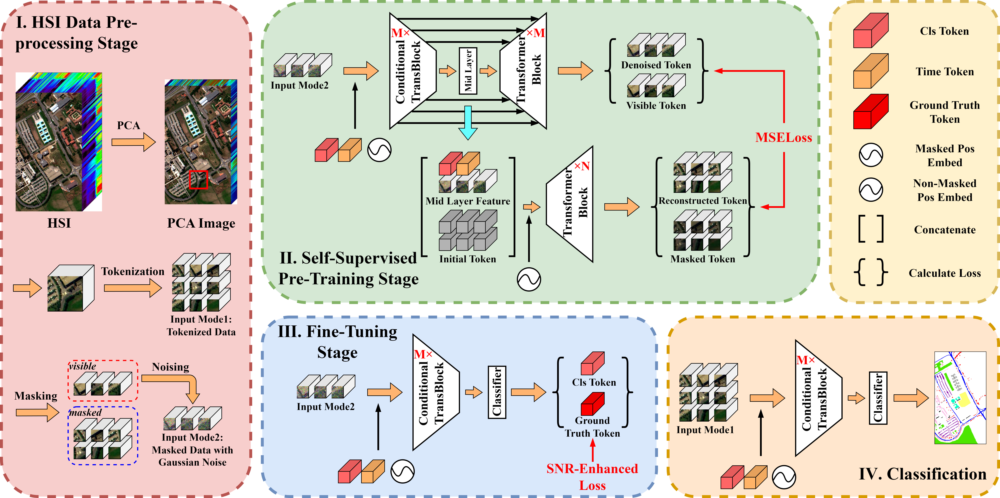
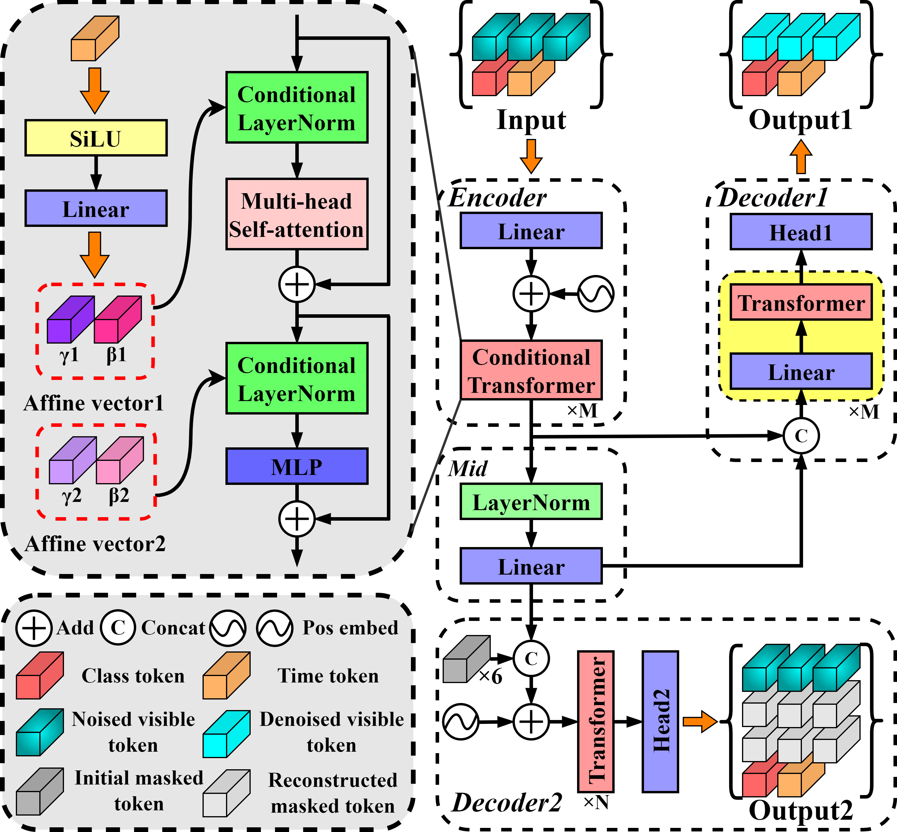

# DEMAE: Diffusion Enhanced Masked Autoencoder for Hyperspectral Image Classification With few Labeled Samples

[Ziyu Li](https://www.researchgate.net/profile/Ziyu-Li-28), [Zhaohui Xue](https://www.researchgate.net/profile/Zhaohui-Xue), [Mingming Jia](https://www.researchgate.net/profile/Mingming-Jia-2), [Xiangyu Nie](https://www.researchgate.net/profile/Xiangyu-Nie-2), [Hao Wu](https://www.researchgate.net/profile/Hao-Wu-448), [Mengxue Zhang](https://www.researchgate.net/profile/Mengxue-Zhang-12), [Hongjun Su](https://www.researchgate.net/profile/Hongjun-Su)

___________

This is a slim implementation of the "DEMAE: Diffusion Enhanced Masked Autoencoder for Hyperspectral Image Classification With few Labeled Samples", which will be published at _IEEE TGRS_ soon! And the official release please sees ["here"](https://github.com/ZhaohuiXue/DEMAE).

**Figure 1: The overview of Diffusion Enhanced Masked Autoencoder, including four stages: HSI Data Pre-processing, Self-Supervised Pre-training, Fine-Tuning and Classification.**

**Figure 2: Pre-training details of Diffusion Enhanced Masked Autoencoder, including Diffusion branch and MAE branch.**

Requirements
---------------------
Running environment and required packages:
    
    python==3.8
    numpy==1.19.5
    matplotlib==3.3.4
    scipy==1.5.2
    scikit-learn==0.23.2
    opencv-python==4.5.1.48
    torch==1.10.2+cu111

Instructions for usage
---------------------
    model.py ...... A script for the implementation of DEMAE.
    model_pretraining.py ...... A script for obtaining the initial model weights through self-supervised pre-training and save the .pt file.
    main.py ...... A main script for hyperspectral image classification.
    data.py ...... A data processing script for hyperspectral image.
    loop_train_test.py ...... Perform iterative training and testing loops, saving the model weights in the 'save\models' directory, and storing the confusion matrix of the test results in the 'save\results' directory.
    loss_function.py ...... A script for calculating training loss.
    visualization.py ...... A script for drawing and visualization.

1. Begin by running model_pretraining.py for self-supervised pre-training an initial model weight, and the script will automatically save the weight with the minimum loss in the "./save/pretrained_weights" folder. We have provided pre-trained weights on PU (University of Pavia), SA (Salinas), HU (University of Houston) and LK (WHU-Hi LongKou) datasets in this folder.
2. Proceed to run main.py for model fine-tuning and classification on the specified dataset. Ensure that you accurately type the pre-trained weight's file path into the designated dictionary variable before initiating the process.
3. Only need to modify the "pretrained_weights_path" variable in the designated dictionary and the corresponding hyperparameters in main.py for cross-domain experiments.
4. Welcome to perform self-supervised pre-training on your own dataset, and we would be grateful if you could make it public!
